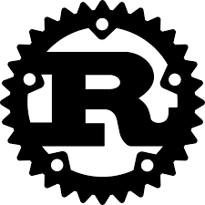

# Guia de estudo do Rust + Rocket


<div style="display: flex; gap: 10px; align-items: center; background-color:white;">
  
  
</div>


## Docs

- [Rust Book](https://doc.rust-lang.org/book/)
- [Interactive Rust Book](https://rust-book.cs.brown.edu/)
- [Rocket Guide](https://rocket.rs/guide/v0.5/introduction/)
- [Crates.io](https://crates.io/)


## Projects
1. Capítulo 01
- [Hello World](./projects/capitulo-01/hello_world/main.rs)
- [Hello Cargo!](./projects/capitulo-01/hello_cargo)
2. Capitulo 02
- [Guessing Game](./projects/capitulo-02/guessing_game)
3. Capitulo 03
-

## Rust

### Capítulo 1: Getting Started
#### Instalando e verificando a versão no linux

```bash
curl --proto '=https' --tlsv1.2 https://sh.rustup.rs -sSf | sh
```

#### Verificando a versão instalada

```bash
rustup --version
```

#### Atualizando a versão do Rust
```bash
rustup update
```

#### Cargo
[Cargo is Rust’s build system and package manager](https://rust-book.cs.brown.edu/ch01-03-hello-cargo.html)

##### Verificando a versão instalada

```bash
cargo --version
```

##### Criando um novo projeto com o Cargo
```bash
cargo new hello_cargo
```

##### Build do projeto com o Cargo
```bash
cargo build
```

##### Rodando o projeto
```bash
cargo run
```

##### Verifica se o projeto compila
```bash
cargo check
```

##### Criando a release do projeto
```bash
cargo build --release
```

##### Cargo Watch
Cargo does not watch your files by default. But you can use plugins like cargo-watch for this purpose.

```bash
cargo install cargo-watch --locked
cargo-watch
```

##### Gerando a doc das dependências com o Cargo
```bash
cargo doc --open
```

### Capítulo 2: Guessing Game

Capítulo de projeto.

Especificações:
- Fazer um jogo de advinhação de números


Desafio extra:
- Limitar a quantidade de palpites


### Capitulo 3: Common Programming Concepts
